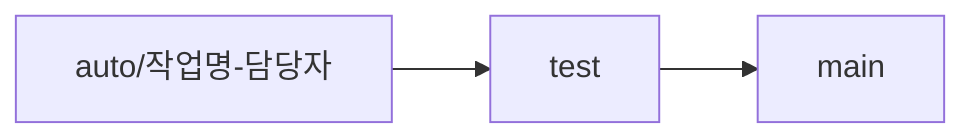

# 🚔 오토스 Autos

**협업 자동화를 직접 설계하고 구현하는 스터디**  
DevOps · Automation · AI · Collaboration

---

## 🚔 About Autos

> 💡 **`이거 자동으로 안되나?`라는 순간을 해결합니다**

오토스는 개발 협업 과정에서 발생하는 문제를 자동화와 AI를 활용해 직접 해결해보는 스터디입니다.

- ⏱ PR 리뷰 지연
- 🔁 반복 작업
- 😵 협업 병목

---

## 🥅 Study Goal

### 프로젝트 사전 준비

> 합세, 앱잼 전에 자동화 환경을 구축합니다.

### 반복 작업 자동화

> PR, 리뷰, 배포, 테스트를 자동화합니다.

### 포트폴리오 경험

> 협업 문제 해결 경험을 결과물로 남깁니다.

---

## 👥 Members

> 각 팀원은 하나의 협업 문제를 정의하고, 자동화로 해결합니다.

|  |  |  |  |
| :----------------------------------------------------: | :----------------------------------------------------: | :-----------------------------------------------------: | :-------------------------------------------------------: |
|                       **백지연**                       |                       **강효정**                       |                       **김민아**                        |                        **김정민**                         |
|         [@jyeon03](https://github.com/jyeon03)         |         [@ahyohyo](https://github.com/ahyohyo)         |        [@kimminna](https://github.com/kimminna)         |       [@jjangminii](https://github.com/jjangminii)        |

 

|  |  |  |
| :-------------------------------------------------------------: | :----------------------------------------------------: | :----------------------------------------------------------: |
|                           **김진아**                            |                       **박소이**                       |                          **박진석**                          |
|    [@jinaaaaaaaaaaaaa](https://github.com/jinaaaaaaaaaaaaa)     |         [@soyyyyy](https://github.com/soyyyyy)         |      [@jin-evergreen](https://github.com/jin-evergreen)      |

---

## 🌿 Branch Strategy
> 작업 브랜치에서 구현 후 test에서 검증하고, 테스트 성공 후 main에 반영합니다.

